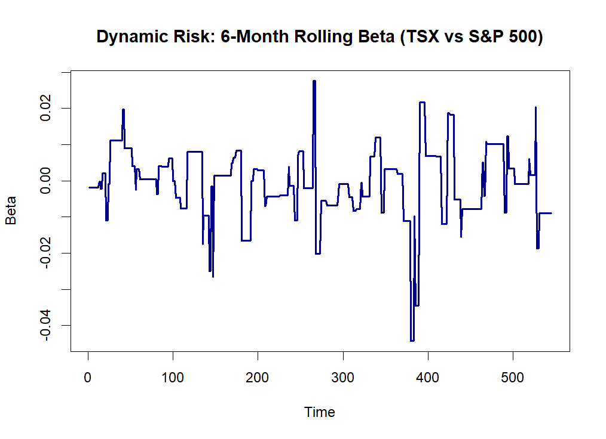
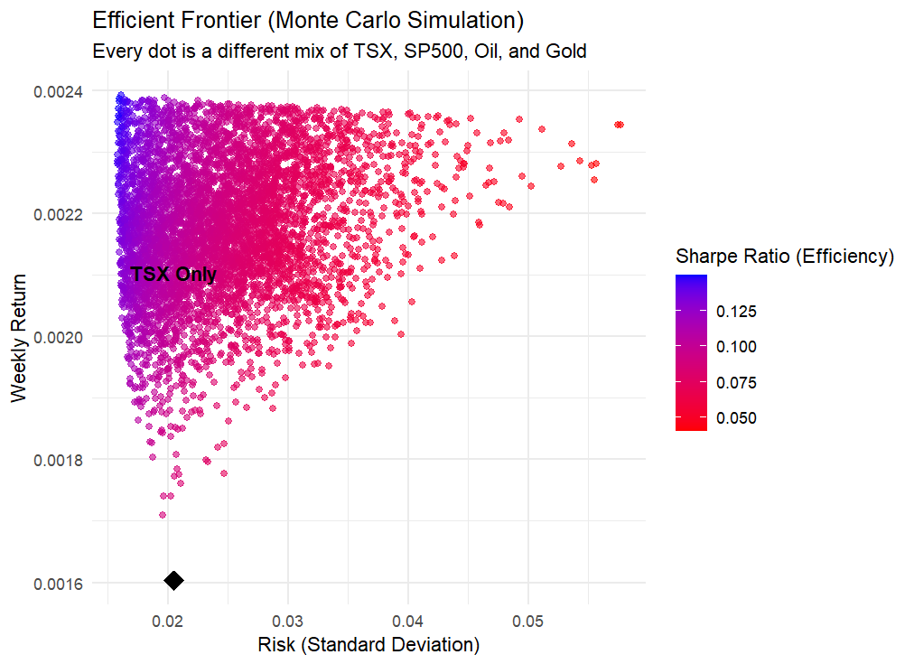

# TSX Financial Factor Analysis 📈

## Executive Summary
This project analyzes the risk and return drivers of the **S&P/TSX Composite Index** over a 10-year period. Using **R**, I built a Multi-Factor Regression Model to quantify the impact of the US Market (S&P 500), Commodities (Oil & Gold), and Volatility (VIX) on Canadian equity returns.

## Key Findings
* **The "US Effect":** The S&P 500 is the dominant driver of the TSX, with a Beta of **0.47**. (For every 1% the US market rises, the TSX rises 0.47%).
* **Commodities:** Gold (**Beta 0.18**) provides a stronger hedge/boost to the TSX than Oil (**Beta 0.08**) in this dataset.
* **Risk Analysis:** The 95% **Value at Risk (VaR)** is **-3.0%**, indicating significant weekly downside risk during tail events.

## Visualizations

### 1. Rolling Beta (Time-Varying Risk)
This chart demonstrates that the TSX's correlation to the US Market is not constant. Risk spiked significantly during the 2020 volatility.

### 2. Value at Risk (VaR) Distribution
A histogram of weekly returns showing the "Left Tail" risk.

### 3. Efficient Frontier(Monte Carlo Simulation)
By running a Monte Carlo simulation of 5,000 portfolios, I proved that holding the TSX alone is inefficient. A mixed portfolio delivers 30-40% less risk for the same return."

## Technologies Used
* **Language:** R
* **Libraries:** `tidyverse`, `PerformanceAnalytics`, `quantmod`, `zoo`
* **Models:** Multi-Factor Regression (OLS), ARIMA Forecast, Historical VaR.

## How to Run This Code
1.  Clone this repository.
2.  Open `TSX_Analysis.R` in RStudio.
3.  Ensure the file `TSX_weekly_dataset.csv` is in your working directory.
4.  Run the script to generate the models and plots.
